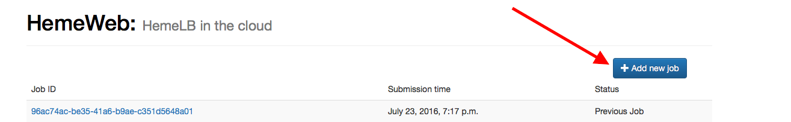
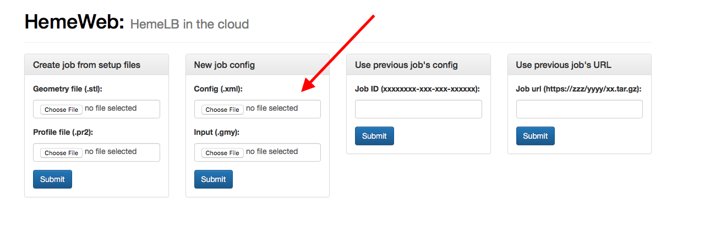
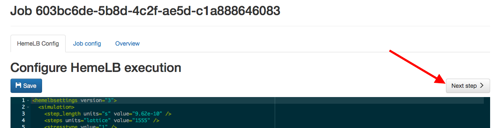
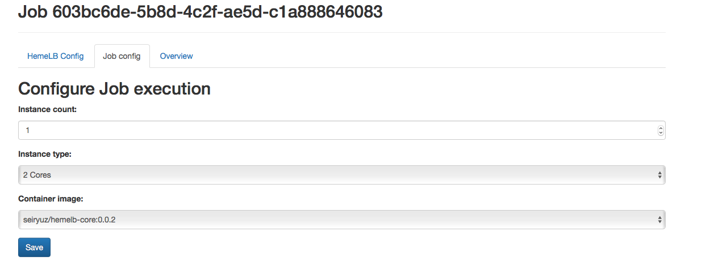
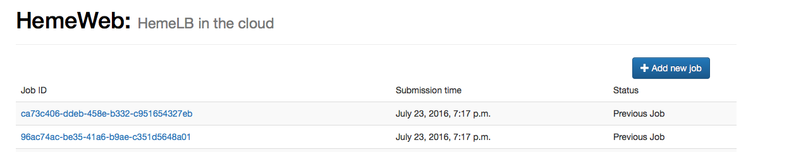
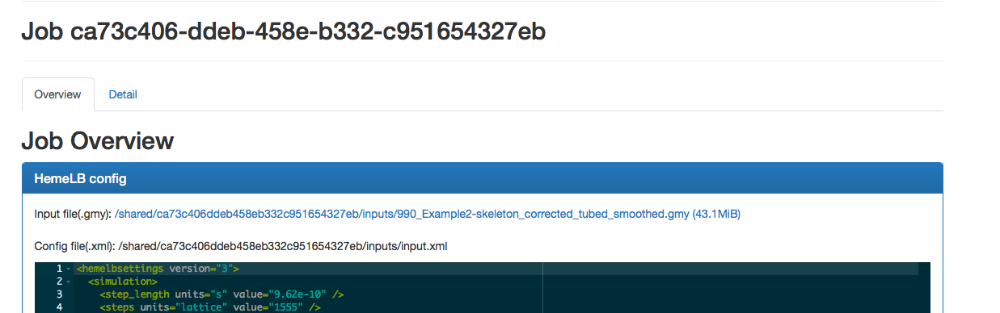
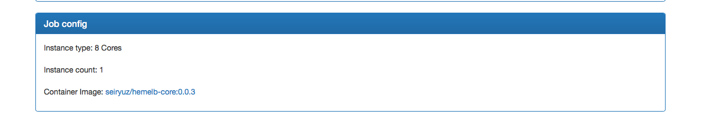
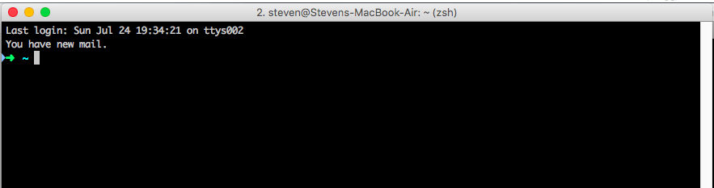
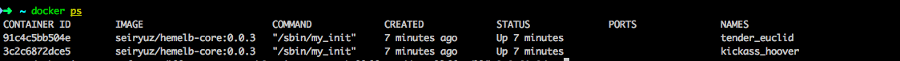
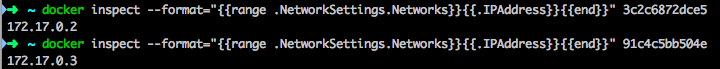

## Introduction

Hi there,

I, Steven, am writing dissertation titled "HemeWeb: Blood flow simulation on the cloud" for my MSc. Today, I will be conducting an evaluation on my project to measure usability of the developed approach compared with the original.

In this evaluation, I will need your help to run two different approaches to run same blood flow simulation, followed by a short questionaire to measure your experience. During the session, the screen will be recorded for evaluation purposes. It is to be noted that there are no right or wrong in running this simulation, so you do not have to worry. If in any of the process, you become uncomfortable, we will stop the session and you are free to leave. This session should last around X minutes.

Once again, thank you for helping me with my work.


Steven


## About the blood flow simulation

In this evaluation, you will run a blood flow simulation using
tools named HemeLB. The software will take sets of input and run
simulation to produce specific outputs from it.


We will compare the usability aspect of the simulation process using two
different approach, using command line and using web interface. You will
be given instruction on how to do both approach.


## Demographic questions

1. Age
  * [ ] 11 - 15
  * [ ] 16 - 20
  * [ ] 21 - 25
  * [ ] 26 - 30
  * [ ] 31 - 35
  * [ ] over 36

2. Gender
  * [ ] Male
  * [ ] Female

3. Profession?
  * [ ] Student (Related with informatics)
  * [ ] Student (Not related with informatics)
  * [ ] Biologist
  * [ ] Doctor
  * [ ] Lecturer
  * [ ] Other ..................

4. Familiar with operating command line interface ?
  * [ ] Yes
  * [ ] No

5. If familiar with command line interface. How long have you been using
   it?
  * [ ] < 1 years
  * [ ] 1 - 2 years
  * [ ] 2 - 3 years
  * [ ] > 3 years

7. Familiar with operating web browser (Chrome / Safari / IE / Opera)?
  * [ ] Yes
  * [ ] No

8. If familiar with web browser. How long have you been using it?
  * [ ] < 1 years
  * [ ] 1 - 2 years
  * [ ] 2 - 3 years
  * [ ] > 3 years

9. Familiar with blood flow simulation tools ?
  * [ ] Yes
  * [ ] No


## Simulation Web Browser - Recorded session

1. Tell me that you are about to start. I will start the screen
   recording software

2. With the provided browser, safari, go to http://53.12.13.14
  

3. Click on add new job
  

4. I have prepared two input files to be used. They are in the desktop
   folder.
  ```
  \Users\steven\Desktop\input.xml
  \Users\steven\Desktop\input.gmy
  ```

5. Use the provided input files above for "New job config" form
  

6. Click "Submit"

7. Configure the simulation with these parameters

   ```
      HemeLB config: No change
      Container Image: SeiryuZ/hemelb-core:0.0.2
      Image type: 8 core
      Instance count: 2
   ```
8. In the "HemeLB config" click on next step
  

9. In the "Job config" change the job configuration as specified in step 7 and click save
  

10. In the overview tab and review the parameters one final time

11. Scroll to the bottom and click on "All good! Queue job"

12. Tell me, or the person observing you, that you are finished. I will
   stop the screen recording software


## Simulation Web Browser - Evaluations

1. How easy do you find the interface to use?
  * [ ] Very hard
  * [ ] Hard
  * [ ] easy
  * [ ] Very easy

2. Did the interface give a clear instruction on each steps of the
   process?
  * [ ] Very unclear
  * [ ] Unclear
  * [ ] Clear
  * [ ] Very clear

3. Below are a screenshot of the homepage of the interface and the
   overview of one of the previous simulation. Do you think
   this provide clear information of pasts simulation ?
  * [ ] Very unclear
  * [ ] Unclear
  * [ ] Clear
  * [ ] Very Clear

  Homepage
  

  Overview
  
  


## Simulation Command Line

1. Tell me that you are about to start. I will start the screen
   recording software

2. Open terminal (cmd shift t)

3. Your screen should look like this
  

4. First, we are going to start two container running hemelb cores
   ```
  docker run -i -d -v ~/Desktop/hemeweb/:/data  -t seiryuz/hemelb-core:0.0.3
  docker run -i -d -v ~/Desktop/hemeweb/:/data  -t seiryuz/hemelb-core:0.0.3
   ```
  *Lines above are intended to be entered twice*

5. Find out the CONTAINER ID of created containers
   ```
  docker ps
   ```
  

6. Find out the IP of both containers
   ```
  docker inspect --format="{{range .NetworkSettings.Networks}}{{.IPAddress}}{{end}}" <CONTAINER_ID_1>
  docker inspect --format="{{range .NetworkSettings.Networks}}{{.IPAddress}}{{end}}" <CONTAINER_ID_2>
   ```
  

7. Run HemeLB simulation on both containers using this command
   ```
   docker exec <CONTAINER_ID_1> openmpi.mpirun --mca btl_tcp_if_include eth0 \
   -np 4 --host <CONTAINER_IP_1>,<CONTAINER_IP_2> \
   hemelb -in $HEMELB_INPUT -out $HEMELB_OUTPUT 1> $LOG_FILE 2>&1
   ```

8. Tell me, or the person observing you, that you are finished. I will
   stop the screen recording software


## Simulation Command Line - Evaluations

1. How easy do you find the interface to use?
  * [ ] Very hard
  * [ ] Hard
  * [ ] easy
  * [ ] Very easy

2. Did the interface give a clear instruction on each steps of the
   process?
  * [ ] Very unclear
  * [ ] Unclear
  * [ ] Clear
  * [ ] Very clear


## Overall Evaluation

1. Which one do you prefer to use ?
  * [ ] Command line interface
  * [ ] Web browser

2. If you choose command line, why do you prefer it?
  * [ ] It is faster
  * [ ] It is more flexible
  * [ ] Others .....

3. If you choose web browser, why do you prefer it ?
  * [ ] It is faster
  * [ ] It is easier
  * [ ] Others .......

