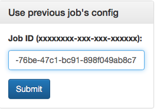
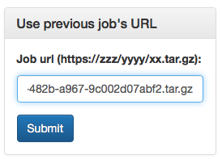
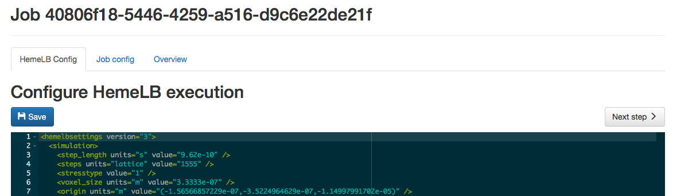
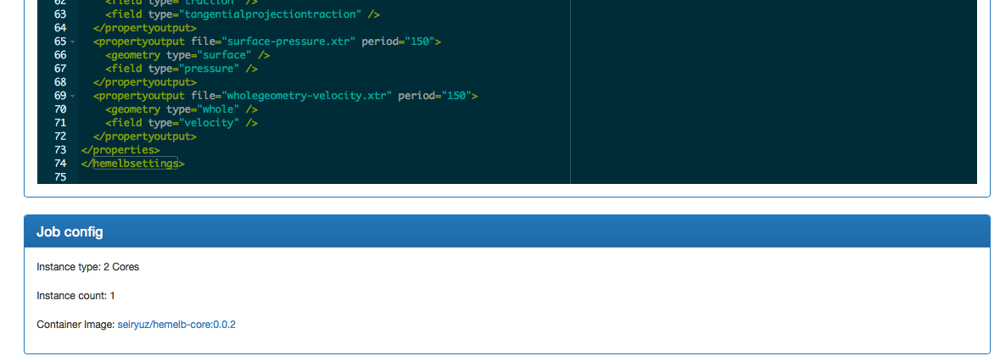

## Introduction

Hi there,

I, Steven, am writing my MSc dissertation titled "HemeWeb: Blood flow simulation on the cloud". Today, I will be conducting a usability testing for the project's evaluation with your help.

In this evaluation, I will ask you to run a blood flow simulation using two different approach. Following each simulation, few questions will be asked to measure your experience in using said interface. Also, during the session, your screen will be recorded for evaluation purposes. It is to be noted that there are no right or wrong in running this simulation, so you do not have to worry. If in any of the process, you become uncomfortable, we will stop the session and you are free to leave. This session should last around 20-30 minutes.

Once again, thank you for helping me with my work.


Steven


## About the blood flow simulation

You will run a blood flow simulation using tools called HemeLB.
The software will take sets of input and run
simulation to produce desired outputs from it.


We will compare the usability aspect of the simulation process using two
different interface; command line interface and web interface. You will
be given instruction on how to do use both approaches. But first, some
questions to know you better


## Demographic questions

1. Age
  * [ ] 18 - 20
  * [ ] 21 - 30
  * [ ] 31 - 40
  * [ ] over 40

2. Gender
  * [ ] Male
  * [ ] Female

3. Career stage
  * [ ] MSc student
  * [ ] PhD student
  * [ ] PDRA
  * [ ] Lecturer
  * [ ] Professor

4. Discipline
  * [ ] Informatics / CS
  * [ ] Computational Scientist
  * [ ] Biological Scientist
  * [ ] Clinician
  * [ ] Other ..................

5. Familiar with operating command line interface ?
  * [ ] Yes
  * [ ] No

6. If familiar with command line interface. How long have you been using
   it?
  * [ ] < 1 years
  * [ ] 1 - 2 years
  * [ ] 2 - 3 years
  * [ ] > 3 years

8. Familiar with operating web browser (Chrome / Safari / IE / Opera)?
  * [ ] Yes
  * [ ] No

9. If familiar with web browser. How long have you been using it?
  * [ ] < 1 years
  * [ ] 1 - 2 years
  * [ ] 2 - 3 years
  * [ ] > 3 years

10. Familiar with docker?
  * [ ] Yes
  * [ ] No

11. If familiar with docker. How long have you been using it?
  * [ ] < 1 years
  * [ ] 1 - 2 years
  * [ ] 2 - 3 years
  * [ ] > 3 years

12. Familiar with HemeLB ?
  * [ ] Yes
  * [ ] No


## Simulation Web Browser - Recorded session

1. Tell me that you are about to start. I will start the screen
   recording software

2. With the provided browser, safari, go to http://53.12.13.14
  

3. Click on add new job
  

4. I have prepared two input files to be used. They are in the desktop
   folder.
  ```
  \Users\steven\Desktop\input.xml
  \Users\steven\Desktop\input.gmy
  ```

5. Use the provided input files above for "New job config" form
  

6. Click "Submit"

7. Configure the simulation with these parameters

   ```
      HemeLB config: No change
      Container Image: SeiryuZ/hemelb-core:0.0.2
      Image type: 8 core
      Instance count: 2
   ```
8. In the "HemeLB config" click on next step
  

9. In the "Job config" change the job configuration as specified in step 7 and click save
  

10. In the overview tab and review the parameters one final time

11. Scroll to the bottom and click on "All good! Queue job"

12. Tell me, or the person observing you, that you are finished. I will
   stop the screen recording software


## Simulation Web Browser - Evaluations

1. How easy do you find the interface to use?
  * [ ] Very hard
  * [ ] Hard
  * [ ] easy
  * [ ] Very easy

2. Did the web interface give a clear direction / hint on what you should do next?
  * [ ] Very unclear
  * [ ] Unclear
  * [ ] Clear
  * [ ] Very clear

3. Below are a screenshot of the homepage of the interface and the
   overview of one of the previous simulation.

  Homepage
  

  Previous simulation's configuration are preserved
  
  

   Do you think this provide clear information of pasts simulation ?
  * [ ] Very unclear
  * [ ] Unclear
  * [ ] Clear
  * [ ] Very Clear


## Simulation Command Line

1. Tell me that you are about to start. I will start the screen
   recording software

2. Open terminal (cmd shift t)

3. Your screen should look like this
  

4. First, we are going to start two container running hemelb cores
   ```
  docker run -i -d -v ~/Desktop/hemeweb/:/data  -t seiryuz/hemelb-core:0.0.3
  docker run -i -d -v ~/Desktop/hemeweb/:/data  -t seiryuz/hemelb-core:0.0.3
   ```
  *Lines above are intended to be entered twice*

5. Find out the CONTAINER ID of created containers
   ```
  docker ps
   ```
  

6. Find out the IP of both containers
   ```
  docker inspect --format="{{range .NetworkSettings.Networks}}{{.IPAddress}}{{end}}" <CONTAINER_ID_1>
  docker inspect --format="{{range .NetworkSettings.Networks}}{{.IPAddress}}{{end}}" <CONTAINER_ID_2>
   ```
  

7. Run HemeLB simulation on both containers using this command
   ```
   docker exec <CONTAINER_ID_1> openmpi.mpirun --mca btl_tcp_if_include eth0 \
   -np 4 --host <CONTAINER_IP_1>,<CONTAINER_IP_2> \
   hemelb -in $HEMELB_INPUT -out $HEMELB_OUTPUT 1> $LOG_FILE 2>&1
   ```

8. Tell me, or the person observing you, that you are finished. I will
   stop the screen recording software


## Simulation Command Line - Evaluations

1. How easy do you find the interface to use?
  * [ ] Very hard
  * [ ] Hard
  * [ ] easy
  * [ ] Very easy

2. Did the command line interface give a clear instruction on what to do
   next?
  * [ ] Very unclear
  * [ ] Unclear
  * [ ] Clear
  * [ ] Very clear


## Overall Evaluation

1. Which one do you prefer to use ?
  * [ ] Command line interface, continue to question 2
  * [ ] Web browser, continue to question 3

2. If you choose command line, why do you prefer it (You can pick more
   than one)?
  * [ ] It is faster
  * [ ] It is more flexible
  * [ ] It is easier
  * [ ] Others .....

3. If you choose web browser, why do you prefer it (You can pick more
   than one) ?
  * [ ] It is faster
  * [ ] It is more flexible
  * [ ] It is easier
  * [ ] Others .......

4. The development of the web interface is to hide the complexity of the
   process of running simulation. Do you think the web interface achieve
   its purpose of hiding complexity from the user?
  * [ ] Strongly disagree
  * [ ] Disagree
  * [ ] Agree
  * [ ] Strongly agree
  * [ ] Neither agree nor disagree

5. Another goal of the web interface is to easily allow people to
   inspect, reproduce and replicate simulation instances.
   The way the web interface allow these feture is by allowing job to come from
   previous job or other people's experiment file.

  Reproduce previous simulation

  

  or Reproduce other people's simulation

  

  The specified previous or other people's simulation's parameter are
preserved and can be modified in the next screen like how we
configure the simulation parameters.

  
  

   Do you think this web interface allow you to inspect, reproduce and replicate other's simulation easily?
  * [ ] Strongly disagree
  * [ ] Disagree
  * [ ] Agree
  * [ ] Strongly agree
  * [ ] Neither agree nor disagree
