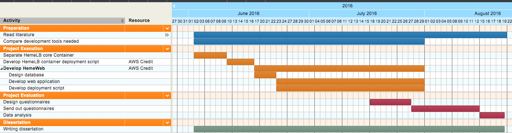

# HemeWeb: Container based high performance computing scenario in cloud infrastructure for HemeLB

## Steven Steven - s1561690

## I. Introduction

HemeLB is a fluid dynamics simulation software package that is developed for the study of blood flow [1]. Researches in computational biology have used HemeLB to help with their study. Some of its latest use are simulating blood vessel development in mouse [2] and its retina [3]. Another study used HemeLB to study vascular blood flow abnormalities in human eye [4]. The software package works by constructing a 3D model of blood vessels, and then approximating the equation governing fluid flow within. This allows scientists and doctors to estimate how blood will flow in the given vessels. It is evident that HemeLB simulation is important for medical study. Furthermore, HemeLB is envisioned to be an integral part of future medical decisions [5].

However, it is currently complex to configure and run the software packages. The complete workflow comprises of many steps that need many tools to run. Scientists and doctors might not have the capabilities to configure these tools. Furthermore, the resources needed to run these workflow also varies widely depending on the case. While small cases can run on a laptop, scientifically interesting cases require parallel computing resources, like the ARCHER supercomputer, to run. In addition, for each step of the workflow, different interfaces are required; from command line to graphical user interface. These factors limits HemeLB's user to few individuals currently.

Furthermore, the HemeLB project needs to improve the trustworthiness of its simulation.  This trust, on top of HemeLB being usable, is important to make it a part of
 any medical decision. Simulation results should be easy to audit and easy to
 reproduce. These characteristics allow peers to review the simulation and
 confirm the result. Currently, there are some measures in HemeLB for
 reproduction and audit. Its source code is available for public on GitHub,
 making it possible to audit the software. Furthermore, the system
includes some tools to automatically record version used, and the input
parameters.  These steps allow peers to build the software and replicate a simulation, albeit in a manual way. With recent pushes for open science and reproducible computing research [6, 7, 8], an extra step for being open is justified.

To address these problems, I propose to create an extension to HemeLB called HemeWeb.
  HemeWeb will be a web application that will hide the complexity of configuration from its users. Also, it will allow automatic recording of simulations, making it
 easy to examine and reproduce simulations. I will use cloud infrastructure and
 containerization technology to help address the issues outlined. In brief,
 this project will make HemeLB simulations usable and more open.

## II. Background

To develop the extension with proper functions, I need to elaborate some information. These are about the current HemeLB workflow, the infrastructures, containerization technology, and how similar project tackle similar problems.

**Current HemeLB Workflow**

Figure 1 illustrates the current steps in the HemeLB workflow. I will now ellaborate  processes, resources and interfaces needed for each steps.

1. **Geometrical model reconstruction**

  Before preparing a simulation, users require a 3D model of the
vessels they wish to simulate. This step is out of the scope of this
project but typically involves taking a 2D image of blood vessels or 3D
CT scan data and constructing its 3D representation in a .stl format.
This step typically run in a workstation with problem-dependant tools
and interface.

2. **Domain definition**

  In this step, users' inputs about simulation parameters are needed. User needs to configure simulation parameters like blood viscosity, inlet and outlet placements, and other conditions. A graphical user interface has been developed for this purpose. Allowing doctors and users to use it easily on a workstation without resorting to command line interface. These information are then encoded into a profile file that will be used in the next step.

3. **Geometry generation**

  In this step, the 3D model of blood vessel's surface and the simulation parameters are combined to produce a description of the 3D domain, i.e. a list of every point in space to be simulated and its properties, and the other simulation parameters. This step can be time consuming as it is  currently not parallel, but can run on a workstation.

4. **HemeLB simulation**

  This step is where the bulk of the computations are done. The information encoded from previous steps is given as input to the main HemeLB application. It is an efficiently MPI-parallel SPMD program that can efficiently use from 1 up to 32,000 cores [9]. Typical problems use around 500 cores. Very simple problems can be run on a workstation, while demanding cases will require an HPC infrastructure. Users need to use command line interface to do this step.

5. **Post processing**

  Simulation results from previous steps are encoded in a format that is efficient to wwrite in parallel but is not easily viewed. To view the simulation in a graphical way, further processing is needed. This is where post-processing steps will do its work. This step will convert the files into a VTK format, a de facto standard in computational science, that can be viewed with many tools such as Paraview [10] and VisIt [11]. This process run on workstation with a command line interface.

**HPC Infrastructure and HemeLB**

Computational biology and bioinformatics often use mathematical and computation approaches in their research. They use these approaches to help answer questions and understand experiments in biology [12]. While small cases can run on a laptop, more complex case demand parallel computing resources like ARCHER supercomputer. HemeLB is a prime example of computational biology software that need these better computing resources. Its most demanding part, HemeLB simulation, currently run on ARCHER supercomputer [1].

Traditionally, there are two paradigm that tackles large computing processes. These are High Performance Computing and High Throughput Computing (HTC). HPC involve using many similar computing nodes to perform tightly coupled computations. These nodes are often placed in the same room and connected with high bandwidth network. These network allow the nodes to communicate between each other in doing the computations [13]. An example for this type of resources are computer clusters, GPUs, and supercomputers. In contrast, HTC allow  heterogeneous computing resources to cooperate for common goals. These resources are often distributed geographically and varies in type and performance. These resources will then do different independent computations that independently scheduled [13]. Based on these distinctions, HPC is a correct categorization of HemeLB.

<!-- Acquriing access to HPC infrastructure is possible but non-trivial, and maybe not a top priority for these institutes  -->
However, running these simulations requires access to HPC infrastructures that
might not have reproducibility of a research as a priority. Facilities
that operate these infrastructure often give out computing hour usage
to projects based on the merit of their peer-reviewed proposal, for
example how PRACE [14], the Partnership for Advanced Computing in
Europe, and EPSRC [15] give access to their infrastructure to
researchers. This means that those seeking to reproduce computation of a research have to compete with other projects for the limited
computing hours that are given out by these institutions. Most likely, it
will not be the top priority, hence creating barrier for reproducing
computational research.

Not being prioritized in these facilities create a barrier for HemeLB to
become more trustworthy because reproduction of simulation is non-trivial.
As iterated on the previous section, HemeLB project have taken the steps
to address reproducibility of the simulation by manually recording all
the configurationns, tools version, input files, parameters and result of the
simulation. Anyone theoritically could request these documentation and
reproduce the result with the appropriate computing resource.
However, research facility that will prioritize more important research
inherently will limit people that want to reproduce the computation
result significantly. This is where cloud computing infrastructure enter
the picture.

**Cloud Computing**

In response to the huge demand for computational power by researchers and
academics, a concept called grid computing was envisioned in 1990s [16][17].
This vision considered computing resources analogous to power grid, where
user should not care from where the resources are acquired and how it is
delivered to the user.  This paradigm was mainly developed with the interest of researchers and
academia that the business models caters to the most [18]. Grid
computing typically give CPU hours based on the proposal that is vetted
by the institutions. Example of this institution is TeraGrid which
operates until 2011 [19].

Cloud computing shares similar vision with the grid computing paradigm, in that the
computing resources are acquired and delivered are invisible to the
users, but different on the execution of the business model. It is
massively scalable, allows abstract encapsulation of computing resources,
dynamicaly configured and delivered on-demand and most importantly,
driven by economies of scale [18]. Since it is driven by economies of
scale, it is in the interest of cloud providers to provide features
that users actually need and want to pay for, therefore creating a
tight feedback loop between users and the providers to develop the
platform better than how grid computing handle feature developments.

This has allowed cloud vendors to grow significantly, for example in 2013 it
was noted that some cloud vendors could reach more than 90% growth per annum
[20]. This growth further fuels demand and allow them to cut pricing
for their service multiple times [21][22][23] and create more demands.
This development has allowed businesses and institutions to offload their
computational need to the cloud vendors for a price rather than building their own
infrastructure. This scenario could also be used for our purpose of
performing or reproducing computational research without needing to have
access to large HPC systems.

Cloud vendors like Amazon also capitalize on the need for computing
resources for HPC applications [13].
Running HPC applications on cloud platforms, while incurring performance
overhead, can be a viable alternative to supercomputers as shown by
the nekkloud project [24], NASA HPC Applications [25], and HPC
applications benchmark in cloud case study [26]. Also, part of this project is
to demonstrate that HemeLB can run acceptably on a cloud platform.

**How other HPC projects deal with similar problems**

In the past few years, many complex HPC software packages have been deployed to the cloud.  In this section, I will highlight these projects to learn how they solve similar issues.

One similar project is Nekkloud [24]. In this case, Nektar++, a complex high-order finite element code, face similar usability problems. Their original workflow was so complex that only few people can run it. People without computer expertise had a hard time to actually run computations with it. Furthermore, one should  also  get access to a HPC infrastructure to run it, which may not be easy. Nekkloud project is their answer to these problems. It was developed to encapsulate most difficulties in using the software package. Using a web application to provide high level interface instead of using the command line.  Making it more accessible to more people without computing expertise. In addition to that, it ran on cloud infrastructures. Allowing people without dedicated HPC infrastructure to run high-order finite element computations.

Another project that is tackling similar space is Galaxy [27]. Galaxy, a web-based reproducible research platform, uses cloud infrastructure to run its HPC applications. In illustrating its use, the developers have developed a super-resolution spark (SRS) model. This modeling process needs a supercomputing resources to execute the cloud infrastructure provides. These capabilities are also encapsulated in an easy to use web interfaces, making it easy for scientists to run, and share simulations.

Above examples illustrate that a web application can be a viable alternative interface for complex applications. However, this implementation on the cloud also has a negative impact on the applications. Raw performance is lower than dedicated HPC infrastructures. These performance penalty was observed in the projects mentioned already [24][25][26].  Nekkloud authors considered the performance penalty acceptable, because the cloud infrastructures allow flexibility.  This flexibility and the benefit of making it more usable will sometimes outweigh the performance penalty.

Pros and cons of web application for complex HPC projects are area that are often discussed.  But, deployment scenario for these HPC projects in cloud infrastructure are rarely discussed. More specifically, the use of containerization technology in helping tools deployment.

Deploying HPC applications is considered as a time-intensive process
[28]. For example, the ARCHER support team has 36 members [29] to support
this process. One approach to reduce these problems is software
containerization.  Containerization technology is developed to run applications or tools in an isolated environment within a kernel. It is more lightweight than traiditional virtualization technology that use hypervisors to manage virtual machines [30]. Containerization technology has been discussed in high performance computing area. For example how Docker, one of the more popular implementation of containerization technology, is abstracting software environment in the HPC infrastructure [31] and used to build virtual HPC clusters [32]. Also, the shifter project [33] is trying to unleash Docker on HPC infrastructure. Meaning, allowing their HPC infrastructure to use docker capabilities. To date, I am not aware of any discussion on the effect of containerization in running HPC application in cloud.

One of the above projects, Galaxy, support containerization technology for their tools packaging. They used docker, one implementation of linux container software. Galaxy claimed that using docker allow efficiency, isolation, and portability of their tools [34]. These are good traits that could also be helpful for HemeLB.  However, their main contribution to the literature is not on this usage. They focus more on how Galaxy can support reproducible research. Docker, in particular, are often discussed as a promising technology to support reproducible research [35]. Usage of containerization technology, however, are sparsely detailed.

<!--**Containerization technology**-->

<!--Container technology originated from the virtualization technology back-->
<!--in 1960. Back then IBM PC shipped with virtualization software that-->
<!--allow multiple operating systems to be installed into one hardware.-->
<!--Linux Kernel Container is then born to handle this virtualization but on-->
<!--the kernel level, where we could have container that run its own kernel-->
<!--separated from the host. Docker is the technology that pushes the-->
<!--adoption of this technology to the roof. Docker encapsulate tools and-->
<!--commands that allow administartion of this container much easier than-->
<!--before. Making it easy for people to use container in their workflow.-->
<!--More importantly, docker has a public registry where people could-->
<!--publish their dockerfile, and share it with the public. Interested-->
<!--people could just get the file and create their own docker image based-->
<!--on the published file. This is a huge boon in helping docker become-->
<!--popular currently.-->

<!--In reproducing computing researchm docker is deeemed fit to the task,-->
<!--since it allows computing workflow to be documented, published, and-->
<!--re-run easily because everyone has the ability to scrutinize it. This-->
<!--process however, involve an overhead that the author needs to write a-->
<!--dockerfile instead of doing whatever they are doing currently. However,-->
<!--this is a small price to pay in order to make compting reproducible-->
<!--easily. On our case, using docker is a necessary tools. Because with-->
<!--docker, people could scrutinize the tools and commands used to reproduce-->
<!--the research done with HemeLB. More importantly, the tools also will-->
<!--allow us to expand not only handling HemeLB, but also to a more general-->
<!--case of any other HPC applications to be run on the cloud indepenedent-->
<!--of what the infrastructure might be.-->

<!--In dealing with High Performance Computing, infrastructures are-->
<!--typically required to be able to handle multi-core operations easily [4].-->
<!--Be it parallel workload or distributed system workload. This has lead to-->
<!--two separate computing paradigm we know as grid and cluster computing.-->

<!--Cluster computing is a paradigm where two or more computing resources-->
<!--are connected and used concurrently to run a single applications, often-->
<!--the computing resources are made of highly homogenous or similar-->
<!--computing unit mounted in a rack. The type of application run on cluster typically require highly parallel-->
<!--computation like modelling and simulation. This type of application benefits-->
<!--from having a highly interconnected node and data locality that clusters-->
<!--provide [4].-->

<!--On the other hand, Grid computing is a different beast altogether. It-->
<!--allows heterogeneous computing resources, often geographically-->
<!--distributed, to cooperate for a common goals. It is highly dynamic and-->
<!--promis scaling infinitely without regards of physical location of the-->
<!--computing resources [6]. In the UK, grid computing often utilized under-->
<!--the banner of e-science [7], where they provide common middleware,-->
<!--software, and services for scientists to collaborate on their project regardless of physical-->
<!--locations.-->

<!--Both of this type of HPC computing are traditionally done in an in-house-->
<!--manner. Where Universities or government institutions set up a cluster of-->
<!--computing resources or even a supercomputer to do HPC task. Grid-->
<!--computations are also done on in house manner or even utilize public's-->
<!--desktop computer for computational resources, example are the-->
<!--folding@ home and genome@ home projects [8]. Currently however, computing-->
<!--resources are available in the cheap. Cloud computing has entered into-->
<!--the pictures and allow computing resources to be available with a-->
<!--price tag attached to it. It is massively scalable, allow abstract-->
<!--encapsulation of computing resources, dynamically configured,-->
<!--delivered on-demand and driven by economies of scale [5].-->

<!--Cloud computing allowed institutions to offload their pain in procuring-->
<!--and maintaining computing resources to the vendors like Amazon, Google,-->
<!--Microsoft and etc for a price. This price also been reduced multiple times [9][10][11]-->
<!--that comes with economies of scale, making it financially less demanding to-->
<!--run HPC applications without in-house resources. In fact, few HPC-->
<!--applications has been run on the cloud, such as the nekkloud-->
<!--project [12], NASA HPC Applications [13], and few other case study [14]-->
<!--that shows that it is feasible to run HPC applications on the cloud,-->
<!--albeit with performance overhead.-->

<!--This development have make it possible for people or institutions with-->
<!--enough financial means to do some heavy computations without having-->
<!--access to this traditionally expensive in-house computing resources.-->

<!--[need better transition from cloud computing HPC to the push for-->
<!--reproducibility]-->
<!--In scientific computing, there has been a push to make a computational-->
<!--results reproducible even if it is complex [15]. This push make sures that-->
<!--research results adhere to scientific method, that is reproducible by-->
<!--our peers. As traditionally, HPC resources are in-house, this hinders-->
<!--the reproducibility aspect of the research. However, with cloud, this-->
<!--enable people to access this resources more easily, for example:-->
<!--Galaxy [2] that enable people to compose, run, and share their-->
<!--modelling simulation.-->

<!--* History of Research Computing-->
<!--* - Grid Computing-->
<!--* - Cloud Computing-->

<!--* Scientific Computing-->
<!--* - Reproducible research-->
<!--* - Science code manifesto-->
<!--* - Example of scientific computing-->

<!--This has been the condition for past decades [?] because access of-->
<!--computational power is hard to acquire back then [?]. Currently, with-->
<!--the introduction of new computational service such as Infrastructure as-->
<!--A Service, Hardware as a Service, cloud computing has allowed people to-->
<!--acquire this resources easily and dynamically.-->

## III. Main Claim

In this project, I will show that the proposed approach will help the HemeLB project by improving the workflow's usability, auditability, and reproducibility. In this section, I will define what I mean by these terms and outline how I will measure success.

Also, to support these claims, I will develop an experimental web application called HemeWeb. HemeWeb will use container technology to run HemeLB simulations on cloud infrastructure. It will be the basis of future deployment in other commodity hardware infrastructure. For instance, Hospitals would want patient-related simulations to run on their own infrastructures.

* **Usability**

  I will define usability in this project as the ease of use of the software to run a simulation. HemeWeb will reduce cognitive efforts needed to run said simulations. Enabling non computer expert, defined as people who  never compile a C program, to run blood flow simulation with simple documentation. I will measure this usability criteria along four metrics of usability that Nielsen [37] use. These metrics are success rate, time needed, error rate, and user's satisfaction on running a simulation.

* **Reproducibility**

  Ease of reproducing a simulation is the definition of reproducibility in this project. Users, given enough information, should be able to reproduce past simulations with ease. HemeWeb will provide reproducibility by enabling user to reproduce past simulations with simple interface. On top of that, the web application will make it easy to run a simulation with past parameters. Enabling easy reproduction of past simulations. Like how I measure usability criteria, I will also measure reproducibility along four metrics. These are success rate, time needed, error rate, and user's satisfaction on reproducing a past simulation.

* **Auditability**

  I will define auditability as the ease of other parties to confirm and audit a simulation. HemeWeb will record and publish tools, configurations, input files, and simulation results. The use of containerization technology will help capture and publish these information. Especially, when the containerization technology publish the image on a public registry. This in the end, will encourage peer-review which will further improve trust. The same four metrics as above criteria will be used to measure this.

In measuring these 3 criteria, I will run a usability testing at the evaluation period. I will use direct observation, with semi-structured interview technique to capture the desired metrics. More details will be provided in the methodology section.

## IV. Methods

  In developing the web application, I need to compare the available technologies. One instance where this choice is important is the choice of containerization technology. Whichever tools I choose, will have to adhere to the criteria set on previous section. Those criteria are improving usability, reproducibility, and auditability. In addition to that, I will add few other criteria to select the appropriate tools. These could be developer familiarity, features available, and ease of usage of the tools. Based on these combined criteria, I will then select the final implementation to be used on the project.  To make sure that this choices is appropriate, I have been and will continue to read about the subject. Also, I will discuss the proposed method with my peers and supervisors.

Next, I have to make sure that the methods chosen in measuring success is appropriate. For this, I will follow DECIDE framework outlined in this book [36]. In the previous section, each criteria can be measured by 4 metrics. They are success rate, time needed, error rate, and user's satisfaction on doing tasks. Users testing at the evaluation period will be used to measure these metrics. I will ask users to do two task; to run and reproduce a simulation using both old and new approach. Running a simulation will capture usability metrics for both approach. While reproducing a simulation will capture metrics for both reproducibility and auditability.

I will then observe users doing their tasks. From these observations, I can capture the first three metrics. Are they giving up? How long does it take to run a simulation using one of the approach? How many times do they ask for help? Did they find out that the past simulation result is faulty? These are the kind of questions that I will capture from the observation. For the last metrics, satisfaction, I will use a semi-structured interview. This is important to first ask their satisfaction level in an objective, numerical, way. And then continue with qualitative questions to probe more about their experience. These questions are going to be designed in the evaluation preparation period.

However, this usability test will have some limitations. First, these tests will take considerable amount of time, roughly 30 minutes per respondent. To run a simulation, one should go through few steps. And in the test, a user will run four simulation in total. Two for each task, comparing both approaches. Consequently, this increase of cognitive burden may influence the test results to some extends. To minimize this risk, I have to make sure that the tasks are one of the simplest one. Making it less demanding for the users to run a task. However, running these tasks will still need considerable duration. Second limitation is the limited number of users involved in the tests. With the long required durations, the number of tests to be done will be limited. On top of that, it will be a challenge to ask a lot of doctors and scientists to do the tests. The limited number of test results will only allow the analysis to be an indicative measure of how HemeWeb improve usability, reproducibility, and auditability.

## V. Implementation

This section will elaborate the work plan and risks for the project. The project period starts from 2nd of June 2016 to 19th August 2016. In this period, I will work on 4 major tasks. They are the project preparation, execution, evaluation and dissertation writing. Each of these tasks can overlap with each other because of the limited time and many tasks to do. For example, project execution and evaluation will overlap from middle of July. This is intentional because these tasks can run in parallel. With this plan, I have determined that the scope of this project is doable in the duration given. Especially when I structure the project to allow graceful degradation.

* **HemeWeb development plan**

  HemeWeb will be a web application that hides the complexity of running HemeLB simulations. Web application will enable users to interface with a HemeLB simulation via internet browser. Internet browser is such a standard tools that many people can use. Allowing doctors and scientists to run simulation without worry of configurations and complexity.

  Besides being a web application, HemeWeb will also use containerization technology. Allowing the web app to tie down simulation result with the tools used. Having this automatic record will enable easy reproduction and easy audit for interested parties. Furthermore, using container technology will allow HemeWeb to swap tools. Currently, to run simulation with different version of the tools, one should reconfigure everything. Container technology will allow HemeWeb to swap the tools easily. Allowing users to run simulation with different version of tools without worrying about configurations.

  In a nutshell, HemeWeb will replace part of HemeLB simulation workflow like illustrated in figure 3. The first phase of the development will make sure one of the steps to run simulation can run in the cloud. With more and more integrations, more part of the workflow will run in the cloud. This will pave ways for making the simulation workflow run entirely on the browser. Making it even easier for users to run simulation.

  

  In the following section, I will outline how the development of HemeWeb will go. I have divided the development into 5 separate distinct steps. They are:

  1. **Separating HemeLB core into its own container**

      Currently, users need to compile HemeLB and other tools on their own computer before using it. These configurations are complex and need simplification. Hence, developer of HemeLB created a container image with complete tools inside [38]. However, for HemeWeb, this is not ideal. HemeWeb should use a cluster of HemeLB instances to run the simulation. These cluster should just contain HemeLB core instead of having the full tools available. This is why, separating this HemeLB core into its own container should be my first step for this project. I will take the currently available image as a basis, and remove all the unnecessary tools. HemeLB binary should be the only concern of the image.

  2. **Orchestrate HemeLB cluster deployment**

      Next, I plan to create a deployment script for HemeLB. I have select preliminary tools for deploying the HemeLB image into a cluster. However, further investigation in the project execution will be necessary. These tools will configure the cluster in an automatic fashion so that it is ready for use. I will be able to configure the cluster with a script at the end of this task.

  3. **Develop HemeWeb to do HemeLB simulation [Phase 1]**

      This is the first step that HemeWeb will be able to run HemeLB simulations. I will develop the prototype web interface that enable user to run simulation. User can upload their input files, wait for the simulation to finish, and download the result.  In this step, I will have developed a working prototype. This prototype have the smallest scope possible, but still allow simulations to run.  The system should look like in Figure 4.

      

  4. **Extends HemeWeb to handle geometry generation step [Phase 2]**

      After finishing with the previous step, I will extend HemeWeb to handle more functions. This function is the geometry generation step. This step will not result in a different interface for the users, but it will expects different input. After this step is complete, HemeWeb will now work with extra functionalities. The system should look like in Figure 5.

      

  5. **Extends HemeWeb to handle domain definition step or post-processing step [Phase 3]**

      At this point, there are two possible extensions available for HemeWeb. They are the domain definition step or post-processing step. Both of these steps need different technical expertise to complete the integration. I will decide on the project execution on which function I should tackle. This decision will depend on the difficulty, and remaining time for the project. However, it has to emphasized that even without this step, HemeWeb can still work just fine.

* **Risks**

  As with all projects with limited time and budget, there are risks involved
 in this project. First is the chance of project execution not running as
 planned.  This is why, I structure this project to allow it to gracefully
 degrade. Meaning that the project will always have a working product at each
 checkpoints. This is to make sure that I always having working prototype at
 each iteration of the software. Preventing the chance of having nothing to
 show at the end of the project. Second, is the fact that I have to rely
 on external parties for evaluation. Part of the evaluation of the proposed
 system will consists of sending out questionnaires. I have to make sure that
 respondents complete the questionnaires on time. Thus, I structured the
 evaluation and the development part to run concurrently. Making sure I give
 enough time for respondents and for me to remind them.

## VI. Output

This project will create two outputs that HemeLB project will use. They are:

1. Working HemeWeb prototype

    I will develop the prototype in three phases, divided based on the functionalities. In each phase, the prototype will work as a standalone application just fine. With each iteration, I will add more functions to the prototype. The next section, work plan, will add more details on how I will develop the prototype.

2. HemeWeb usability guideline

    In the future, HemeWeb can be the interface for doctors to run simulations. This means that HemeWeb will need further improvement to be ready for general use. Future development can use the work done in this project as a basis for usability feature. Thus, I will create a usability document derived from the analysis done in this project.

## References

[1] Itani, M. A., Schiller, U. D., Schmieschek, S., Hetherington, J., Bernabeu, M. O., Chandrashekar, H., ... & Groen, D. (2015). An automated multiscale ensemble simulation approach for vascular blood flow. Journal of Computational Science, 9, 150-155.

[2] Franco, C. A., Jones, M. L., Bernabeu, M. O., Vion, A. C., Barbacena, P., Fan, J., ... & Coveney, P. V. (2016). Non-canonical Wnt signalling modulates the endothelial shear stress flow sensor in vascular remodelling. Elife, 5, e07727.

[3] Franco, C. A., Jones, M. L., Bernabeu, M. O., Geudens, I., Mathivet, T., Rosa, A., ... & Phng, L. K. (2015). Dynamic endothelial cell rearrangements drive developmental vessel regression. PLoS Biol, 13(4), e1002125.

[4] Bernabeu, M. O., Lu, Y., Lammer, J., Aiello, L. P., Coveney, P. V., & Sun, J. K. (2015, August). Characterization of parafoveal hemodynamics associated with diabetic retinopathy with adaptive optics scanning laser ophthalmoscopy and computational fluid dynamics. In Engineering in Medicine and Biology Society (EMBC), 2015 37th Annual International Conference of the IEEE (pp. 8070-8073). IEEE.

[5] Green, C. (2014, June 14). Computer simulation could become 'integral' in the diagnosis, treatment, or prevention of disease by the end of the century | Science | News | The Independent. Retrieved April 4, 2016, from http://www.independent.co.uk/news/science/computer-simulation-could-become-integral-in-the-diagnosis-treatment-or-prevention-of-disease-by-the-9537730.html

[6] Donoho, D. L. (2010). An invitation to reproducible computational research. Biostatistics, 11(3), 385-388.

[7] Sandve, G. K., Nekrutenko, A., Taylor, J., & Hovig, E. (2013). Ten simple rules for reproducible computational research. PLoS Comput Biol, 9(10), e1003285.

[8] Peng, R. D. (2011). Reproducible research in computational science. Science (New York, Ny), 334(6060), 1226.

[9] Groen, D., Hetherington, J., Carver, H. B., Nash, R. W., Bernabeu, M. O., & Coveney, P. V. (2013). Analysing and modelling the performance of the HemeLB lattice-Boltzmann simulation environment. Journal of Computational Science, 4(5), 412-422.

[10] ParaView homepage. (n.d.). Retrieved April 14, 2016, from http://www.paraview.org/

[11] VisIt homepage. (n.d.). Retrieved April 14, 2016, from https://wci.llnl.gov/simulation/computer-codes/visit/

[12] Huerta, M., Downing, G., Haseltine, F., Seto, B., & Liu, Y. (2000). NIH working definition of bioinformatics and computational biology. US National Institute of Health.

[13] Whitepaper: An Introduction to High Performance Computing on AWS. (2015, August). Retrieved April 4, 2016, from  https://d0.awsstatic.com/whitepapers/Intro_to_HPC_on_AWS.pdf

[14] PRACE Research Infrastructure. (n.d.). Retrieved April 4, 2016, from http://www.prace-project.eu/

[15] ARCHER » Getting Access to ARCHER. (n.d.). Retrieved April 4, 2016, from http://www.archer.ac.uk/access/

[16] Berman, Fran, Geoffrey Fox, and Anthony JG Hey. Grid computing: making the global infrastructure a reality. Vol. 2. John Wiley and sons, 2003.

[17] Foster, I., & Kesselman, C. (Eds.). (2003). The Grid 2: Blueprint for a new computing infrastructure. Elsevier.

[18] Foster, I., Zhao, Y., Raicu, I., & Lu, S. (2008, November). Cloud computing and grid computing 360-degree compared. In Grid Computing Environments Workshop, 2008. GCE'08 (pp. 1-10). Ieee.

[19] Extreme Science and Engineering Discovery Environment. (n.d.). XSEDE | TeraGrid Archives. Retrieved April 4, 2016, from https://www.xsede.org/tg-archives

[20] FSN ~ Outsourcing ~ The economy is flat so why are financials Cloud vendors growing at more than 90 percent per annum?. (2013, March 5). Retrieved April 4, 2016, from http://www.fsn.co.uk/channel_outsourcing/the_economy_is_flat_so_why_are_financials_cloud_vendors_growing_at_more_than_90_percent_per_annum#.UbmtsPlJPGA/

[21] Barr, J. (2014, March 26). AWS Price Reduction #42 – EC2, S3, RDS, ElastiCache, and Elastic MapReduce | AWS Blog. Retrieved April 4, 2016, from https://aws.amazon.com/blogs/aws/aws-price-reduction-42-ec2-s3-rds-elasticache-and-elastic-mapreduce/

[22] Martin, S. (2014, January 24). Announcing Reduced Pricing on Storage | Blog | Microsoft Azure. Retrieved April 4, 2016, from https://azure.microsoft.com/en-us/blog/storage-price-match/

[23] Lardinois, F. (2014, March 25). Google Announces Massive Price Drops For Its Cloud Computing Services And Storage, Introduces Sustained-Use Discounts. Retrieved April 4, 2016, from http://techcrunch.com/2014/03/25/google-drops-prices-for-compute-and-app-engine-by-over-30-cloud-storage-by-68-introduces-sustained-use-discounts/

[24] Cohen, Johanne, et al. "Nekkloud: A software environment for high-order finite element analysis on clusters and clouds." Cluster Computing (CLUSTER), 2013 IEEE International Conference on. IEEE, 2013.

[25] Mehrotra, Piyush, et al. "Performance evaluation of Amazon EC2 for NASA HPC applications." Proceedings of the 3rd workshop on Scientific Cloud Computing Date. ACM, 2012.

[26] He, Qiming, et al. "Case study for running HPC applications in public clouds." Proceedings of the 19th ACM International Symposium on High Performance Distributed Computing. ACM, 2010.

[27] Walker, M. A., Madduri, R., Rodriguez, A., Greenstein, J. L., & Winslow, R. L. (2016). Models and Simulations as a Service: Exploring the Use of Galaxy for Delivering Computational Models. Biophysical journal, 110(5), 1038-1043.

[28] Geimer, M., Hoste, K., & McLay, R. (2014, November). Modern scientific software management using easybuild and lmod. In Proceedings of the First International Workshop on HPC User Support Tools (pp. 41-51). IEEE Press.

[29] ARCHER » People Involved in ARCHER. (n.d.). Retrieved April 15, 2016, from http://www.archer.ac.uk/about-archer/people/

[30] Scheepers, M. J. (2014, February). Virtualization and containerization of application infrastructure: A comparison. In 21st Twente Student Conference on IT (pp. 1-7).

[31] Higgins, J., Holmes, V., & Venters, C. (2015, July). Orchestrating Docker Containers in the HPC Environment. In High Performance Computing (pp. 506-513). Springer International Publishing.

[32] Yu, H. E., & Huang, W. (2015). Building a Virtual HPC Cluster with Auto Scaling by the Docker. arXiv preprint arXiv:1509.08231.

[33] Jacobsen, D. M., & Canon, R. S. Contain This, Unleashing Docker for HPC.

[34] Moreews, F., Sallou, O., & Bras, Y. L. (2015, July). A curated Domain centric shared Docker registry linked to the Galaxy toolshed. In Galaxy Community Conference 2015.

[35] Boettiger, C. (2015). An introduction to Docker for reproducible research. ACM SIGOPS Operating Systems Review, 49(1), 71-79.

[36] Sharp, H., Jenny, P., & Rogers, Y. (2007). Interaction design:: beyond human-computer interaction.

[37] Nielsen, J. (2001, January 21). Usability Metrics. Retrieved April 13, 2016, from https://www.nngroup.com/articles/usability-metrics/

[38] Bernabeu, M. O. (n.d.). GitHub - mobernabeu/docker-hemelb: Docker container with HemeLB installed. Retrieved April 11, 2016, from https://github.com/mobernabeu/docker-hemelb

