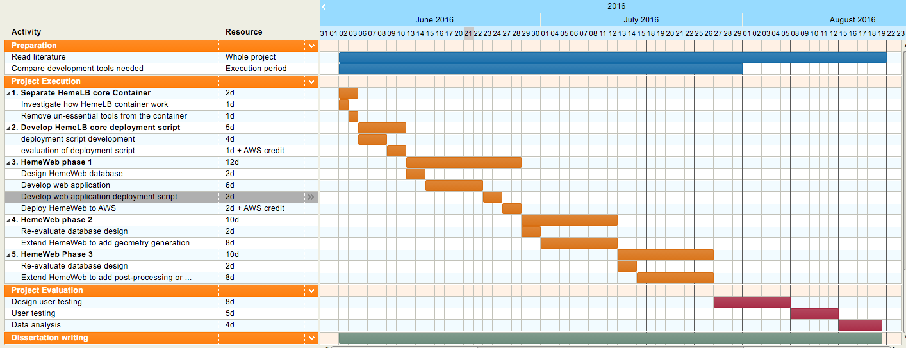

# HemeWeb: Container based high performance computing scenario for HemeLB

## Introduction

HemeLB is a fluid dynamic simulation software that is developed for the study
of blood flow [1]. Part of the software construct a 3D model of blood vessels
from a CT scan or microscopic image of them. This 3D blood vessels allow HemeLB to
simulate the flow of fluid, like blood, inside it. Thus, allowing scientists
and doctors to learn how a blood will flow in a given vessels.
Developers of HemeLB envision that it will be an integral part of medical decisions
in the future [9].

Currently, HemeLB usage is complex and hard. It comprises of many steps in the
workflow that need a diverse set of tools to run. Scientists and doctors need
to configure these tools, which need various technical skills. Time and
difficulty for this configuration limits HemeLB users to few individuals.

Furthermore, HemeLB needs to improve the trustworthiness of its simulation.
This trust, on top of HemeLB being usable, is important to make it a part of
 any medical decision. Simulation results should be easy to audit and easy to
 reproduce. These characteristics allow peers to review the simulation and
 confirm the result. Currently, there are measures for HemeLB for easy
 reproduction and audit. Its' source code are available for public on github,
 making it easy to audit the software. Furthermore, researchers have taken a
 manual record of simulation configurations, executions, and results. These
steps allow peers to build the software and replicate a simulation, albeit
 in a manual way.

HemeLB project can further improve its trustworthiness. Simulation record
automation can make it even easier to reproduce and audit a simulation. Recent
 pushes for open science and reproducible computing research [2-7] also
justifies these steps. Allowing the project to stand in a better light
 and in general, more trustworthy.

For reasons above, I propose to create an extension to HemeLB called HemeWeb.
  HemeWeb is a web application that will hide complexity of configuration from
 its users. Also, it will allow automatic record of simulations, making it
 easy to reproduce simulations. I will use cloud infrastructure and
 containerization technology to help address the issues outlined. In brief,
 this proposal will make HemeLB simulations usable and more trustworthy.

## Background

To develop the extension with proper functions, I need to elaborate some
 information. These are about the current HemeLB workflow, the infrastructures,
 and containerization technology.

**HemeLB Workflow**

Image above illustrate the current workflow of HemeLB.
Currently, HemeLB need many steps to run simulation.
First, a geometrical model reconstruction step
 will construct a 3D model of the blood vessel from 2D image. Next, user will give simulation parameter
 in the domain definition step. Next, a script will convert these information
 into a format that HemeLB understand. After all this step, one can finally
 run HemeLB simulation. This simulation will output a file that needs further
 pre-processing. This pre-processing steps will then output a file that a
 graphical software like VTK can view.

<!--Currently HemeLB workflow is complex-->
On  top of understanding the above workflow, users also need to configure
 tools needed. These configurations are both complex and time-consuming.
 Making the use case not ideal for scientists and doctors. A better situation
 is where simulations can run without worrying about all these configurations.
 Domain experts should only care about their input to the simulations and the outputs.

**HPC Infrastructure and HemeLB**

Computational biology and bioinformatics often use mathematical and computation approaches in their research. They use these approaches to help answer questions and experiments in biology [8]. Unfortunately, these complex computations are so demanding that consumer-grade computing resources are not enough. It often need a highly parallel computing resources to run efficiently. HemeLB is the prime example of bioinformatics software that need these better computing resources. Its most demanding part, HemeLB simulation, currently run on ARCHER supercomputer [1]. These simulations are run to help various studies in the area. One such example is how HemeLB is used for the study of blood vessel development in mouse [27] and its retina [28].  And more importantly, study about blood flow abnormalities in human eye using HemeLB simulation [29]. These simulations, however,  are demanding that it need to run on supercomputers.

One could categorize HemeLB software under High Performance Computing(HPC). Traditionally, there are two paradigm that tackles large computing processes. These are High Performance Computing and High Throughput Computing(HTC). HPC involve using many similar computing nodes to perform well-defined computations. These nodes are often placed in the same room and connected with high bandwidth network. These network allow the nodes to communicate between each other in doing the computations [22]. An example for this type of resources are computer clusters, GPUs, and supercomputers. In contrast, HTC allow  heterogeneous computing resources to cooperate for common goals. These resources are often distributed geographically and varies in type and performance. These resources will then do different independent computations that independently scheduled [22]. Based on these distinctions, HPC is a correct categorization of HemeLB.

<!-- Acquriing access to HPC infrastructure is possible but non-trivial, and maybe not a top priority for these institutes  -->
However, running these simulations require access to HPC infrastructures that
might not have reproducibility of a research as a priority. Facilities
that administer these infrastructure often give out computing hour usage
to projects based on the merit of their peer-reviewed proposal, for
example how PRACE [14], the Partnership for Advanced Computing in
Europe, and how EPSRC [13] give access to their infrastructure to
researcher. This means that reproducing computing research, if anyone
are interested, have to compete with other projects for the limited
computing hour that is given out by these institutions. Most likely, it
will not be the top priority, hence creating barrier for reproducing
computational research, in our case HemeLB simulation.

Not being prioritized in these facilities create a barrier for HemeLB to
become more trustworthy because reproduction of simulation is non-trivial.
As iterated on the previous section, HemeLB project have taken the steps
to address reproducibility of the simulation by manually recording all
the configurationns, tools version, input files, parameters and result of the
simulation. Anyone theoritically could request these documentation and
reproduce the result with the appropriate computing resource.
However, research facility that will prioritize more important research
inherently will limit people that want to reproduce the computation
result significantly. This is where cloud computing infrastructure enter
the picture.

<!-- This is why cloud computing is a perfect match  -->

<!-- Cloud computing is originaly envisioned as computing resource  -->

<!--Running HPC application like HemeLB require  access to HPC-->
<!--infrastructure, which are non-trivial to acquire.-->

<!--Both of these computing paradigm typically requires huge-->
<!--computing resources available to perform its task effectively. HPC task-->
<!--like HemeLB especially, are often run on supercomputers, for example ARCHER-->
<!--supercomputer. This supercomputers requires you to be academics /-->
<!--researchers with clear proposal, for example how epcc give access to-->
<!--ARCHER [10]. Another example is PRACE [11], the Partnership for Advanced Computing in Europe,-->
<!--that allows researcher to access supercomputers accross europe after a-->
<!--vetting process. This theoritically allow people with the credentials-->
<!--to gain access to these resources with the correct motives. However,-->
<!--reproducing research computation that already been run might not be the-->
<!--top priority of these facilities when there are many other research-->
<!--projects that depend on access to these limited resources.-->

**Cloud Computing**

In answering huge computational power required by researchers and
academics, concept called grid computing is envisioned in 1990s [12][15].
This vision consider computing resources analogous to power grid, where
user should not care from where the resources are acquired and how it is
delivered to the user. What user should see is that there are computing
resources available and it could come from anywhere and in any form.
This paradigm is mainly developed with the interest of researchers and
academia that the business models caters to the most [16]. Grid
computing typically give CPU hours based on the proposal that is vetted
by the institutions. Example of this institution is TeraGrid which
operates until 2011 [17].

Cloud computing share similar vision with grid computing paradigm on how the
computing resources are acquired and delivered are invisible to the
users, but different on the execution of the business model. It is
massively scalable, allow abstract encapsulation of computing resources,
dynamicaly configured and delivered on-demand and most importantly,
driven by economies of scale [16]. Since it is driven by economies of
scale, it is in the interest of cloud providers to provide features
that users actually needs and want to pay for, therefore creating a
tight feedback loop between users and the providers to develop the
platform better than how grid computing handle feature developments.

This has allowed cloud vendors to grow significantly, that in 2013 it
was noted that some cloud vendors could reach more than 90% growth per annum
[18]. These growth further fuels demand and allow them to cut pricing
for their service multiple times [19][20][21] and create more demands.
This development has allowed business or institutions to offload their
computational need to the cloud vendors for a price rather than building their own
infrastructure. This scenario could also be used for our purpose of
reproducing computational research without needing to worry about
preventing other researches getting their share of computational
resource.

Cloud vendors like amazon also capitalize on the need of computing
resources for HPC application that they promote themselves for this capabilities [22].
Running HPC application on cloud vendors, while incurring performance
overhead, are a viable alternative to supercomputers as shown by
the nekkloud project [23], NASA HPC Applications [24], and few other case study [25].
HemeWeb project should also run perfectly fine on cloud infrastructures
without worrying about the merit of their reproduction of research
interest being not a top priority.

<!--**Containerization technology**-->

<!--Container technology originated from the virtualization technology back-->
<!--in 1960. Back then IBM PC shipped with virtualization software that-->
<!--allow multiple operating systems to be installed into one hardware.-->
<!--Linux Kernel Container is then born to handle this virtualization but on-->
<!--the kernel level, where we could have container that run its own kernel-->
<!--separated from the host. Docker is the technology that pushes the-->
<!--adoption of this technology to the roof. Docker encapsulate tools and-->
<!--commands that allow administartion of this container much easier than-->
<!--before. Making it easy for people to use container in their workflow.-->
<!--More importantly, docker has a public registry where people could-->
<!--publish their dockerfile, and share it with the public. Interested-->
<!--people could just get the file and create their own docker image based-->
<!--on the published file. This is a huge boon in helping docker become-->
<!--popular currently.-->

<!--In reproducing computing researchm docker is deeemed fit to the task,-->
<!--since it allows computing workflow to be documented, published, and-->
<!--re-run easily because everyone has the ability to scrutinize it. This-->
<!--process however, involve an overhead that the author needs to write a-->
<!--dockerfile instead of doing whatever they are doing currently. However,-->
<!--this is a small price to pay in order to make compting reproducible-->
<!--easily. On our case, using docker is a necessary tools. Because with-->
<!--docker, people could scrutinize the tools and commands used to reproduce-->
<!--the research done with HemeLB. More importantly, the tools also will-->
<!--allow us to expand not only handling HemeLB, but also to a more general-->
<!--case of any other HPC applications to be run on the cloud indepenedent-->
<!--of what the infrastructure might be.-->

<!--In dealing with High Performance Computing, infrastructures are-->
<!--typically required to be able to handle multi-core operations easily [4].-->
<!--Be it parallel workload or distributed system workload. This has lead to-->
<!--two separate computing paradigm we know as grid and cluster computing.-->

<!--Cluster computing is a paradigm where two or more computing resources-->
<!--are connected and used concurrently to run a single applications, often-->
<!--the computing resources are made of highly homogenous or similar-->
<!--computing unit mounted in a rack. The type of application run on cluster typically require highly parallel-->
<!--computation like modelling and simulation. This type of application benefits-->
<!--from having a highly interconnected node and data locality that clusters-->
<!--provide [4].-->

<!--On the other hand, Grid computing is a different beast altogether. It-->
<!--allows heterogeneous computing resources, often geographically-->
<!--distributed, to cooperate for a common goals. It is highly dynamic and-->
<!--promis scaling infinitely without regards of physical location of the-->
<!--computing resources [6]. In the UK, grid computing often utilized under-->
<!--the banner of e-science [7], where they provide common middleware,-->
<!--software, and services for scientists to collaborate on their project regardless of physical-->
<!--locations.-->

<!--Both of this type of HPC computing are traditionally done in an in-house-->
<!--manner. Where Universities or government institutions set up a cluster of-->
<!--computing resources or even a supercomputer to do HPC task. Grid-->
<!--computations are also done on in house manner or even utilize public's-->
<!--desktop computer for computational resources, example are the-->
<!--folding@ home and genome@ home projects [8]. Currently however, computing-->
<!--resources are available in the cheap. Cloud computing has entered into-->
<!--the pictures and allow computing resources to be available with a-->
<!--price tag attached to it. It is massively scalable, allow abstract-->
<!--encapsulation of computing resources, dynamically configured,-->
<!--delivered on-demand and driven by economies of scale [5].-->

<!--Cloud computing allowed institutions to offload their pain in procuring-->
<!--and maintaining computing resources to the vendors like Amazon, Google,-->
<!--Microsoft and etc for a price. This price also been reduced multiple times [9][10][11]-->
<!--that comes with economies of scale, making it financially less demanding to-->
<!--run HPC applications without in-house resources. In fact, few HPC-->
<!--applications has been run on the cloud, such as the nekkloud-->
<!--project [12], NASA HPC Applications [13], and few other case study [14]-->
<!--that shows that it is feasible to run HPC applications on the cloud,-->
<!--albeit with performance overhead.-->

<!--This development have make it possible for people or institutions with-->
<!--enough financial means to do some heavy computations without having-->
<!--access to this traditionally expensive in-house computing resources.-->

<!--[need better transition from cloud computing HPC to the push for-->
<!--reproducibility]-->
<!--In scientific computing, there has been a push to make a computational-->
<!--results reproducible even if it is complex [15]. This push make sures that-->
<!--research results adhere to scientific method, that is reproducible by-->
<!--our peers. As traditionally, HPC resources are in-house, this hinders-->
<!--the reproducibility aspect of the research. However, with cloud, this-->
<!--enable people to access this resources more easily, for example:-->
<!--Galaxy [2] that enable people to compose, run, and share their-->
<!--modelling simulation.-->

<!--* History of Research Computing-->
<!--* - Grid Computing-->
<!--* - Cloud Computing-->

<!--* Scientific Computing-->
<!--* - Reproducible research-->
<!--* - Science code manifesto-->
<!--* - Example of scientific computing-->

<!--This has been the condition for past decades [?] because access of-->
<!--computational power is hard to acquire back then [?]. Currently, with-->
<!--the introduction of new computational service such as Infrastructure as-->
<!--A Service, Hardware as a Service, cloud computing has allowed people to-->
<!--acquire this resources easily and dynamically.-->

## Main Claim

In this project, I will show that the proposed approach will improve HemeLB
 project. I will measure the improvement to the project in usability,
 auditability, and reproducibility. In this section, I will define what
I mean by these terms.

* **Usability**

  I will define usability in this project as the ease of use of the software.
Scientists and doctors should be able to run HemeLB simulations with least efforts.
Least efforts meaning that there are less cognitive load for the users
to use the software. For example, Users will not have to worry about configurations
and piping result from one step to another step.

* **Reproducibility**

  Ease of reproducing simulation instances will be the definition of
 Reproducibility in this project. Targeted users or their peers should be able
 to reproduce past simulations with ease. HemeWeb will improve the
 reproducibility steps by recording every simulation configurations in
 automatic fashion. These records will be available and used for re-running
 the specific simulation. Making it easier for people to make sure
 simulations provide consistent result.

* **Auditability**

  I will define auditability as the ease of other parties to confirm and audit
 a simulation. HemeWeb will record and publish tools, configurations, input
 files, and simulation results. The use of containerization technology will
 help capture and publish these information. Especially, when the
 containerization technology publish the image on a public registry.
 This in the end, will encourage peer-review which will further improve trust.

To support these claim, I will develop an experimental web application called
 HemeWeb. HemeWeb will use container technology and cloud infrastructure to
 run HemeLB simulations. This implementation will show that HemeLB simulation
 can run on cloud infrastructures. Furthermore, it will be the basis of future
 deployment in other commodity hardware infrastructure. For instance,
 Hospitals would want patient-related simulations to run on their private
 infrastructures. Also, HemeWeb will be better interface for HemeLB simulations.

## Methods

In developing the project, there are various alternative that need consideration. The most important one is the usage of the technology. One instance where this choice is important is the choice of containerization technology.  Whatever tools I choose will have to adhere to the criteria on previous section. Those criteria are improving usability, reproducibility, and auditability. In addition to that, I will add few other criteria to select the appropriate tools. These could be developer familiarity, features available, and ease of usage of the tools. I will then select the final implementation of the solution based on these criteria.

Comparison of the tools will be the most important steps of the project. This choice will shape the underlying technology the project will take. To make sure that it is appropriate, I have been and will continue to read about the subject. Also, I will discuss the proposed method with my peers and supervisors.

Next, I will need to select methodologies to make sure the project have good usability. This book [26] list processes in interaction design that is appropriate for this project. I will establish the usability goal of this project first before doing anything. This is important to make sure that the proposed system will address users need. Next I will develop a prototype that take the usability goals in mind. And finally, the prototype will be evaluated against the usability goals.

## Evaluation

I will evaluate this project by employing a usability testing. This test will be developed by following DECIDE framework outlined in this book [26]. This framework will require me to first determine the usability goals.  These usability goals will shape the evaluation part of the project. Second, to Explore the questions. I will have to articulate the usability questions for the test. Third, I have to choose the appropriate evaluation method for this project. Will interview, questionnaires, or observation be enough for evaluating this project? Or we need combination of the methods? Fourth, to Identify potential issues with the evaluation. Fifth, Decide about ethical issues. And last, evaluate, interpret, and present the gathered data.

Following this framework, I have derive a plan to evaluate the project. Two groups of users will be selected for this test. They are doctors / scientists, and peers from informatics schools. These testers will try to run HemeLB using both the current and proposed approaches. I will then observe the testers interaction with the system. Taking note of difficulties and time needed to complete the scenario. After running both approaches, I will then ask testers to fill out questionnaires. These questionnaires will be a closed-questions questionnaires measuring their experience in using the software.  Information gathered from this test will then be analyzed and used to measure success.

## Output

This project will create two outputs that HemeLB project will use. They are:

1. Working HemeWeb prototype

    I will develop the prototype in three phases, divided based on the functionalities. In each phase, the prototype will work as a standalone application just fine. With each iteration, I will add more functions to the prototype. The next section, work plan, will add more details on how I will develop the prototype.

2. HemeWeb usability guideline

    In the future, HemeWeb can be the interface for doctors to run simulations. This means that HemeWeb will need further improvement to be ready for general use. Future development can use the work done in this project as a basis for usability feature. Thus, I will create a usability document derived from the analysis done in this project.

## Work Plan

This final section will elaborate the work plan for the project. The project period starts from 2nd of June 2016 to 19th August 2016. In this period, I will work on 4 major tasks. They are the project preparation, execution, evaluation and dissertation writing. Each of these tasks can overlap with each other because of the limited time and many tasks to do. For example, project execution and evaluation will overlap from middle of July. This is intentional because these tasks can run in parallel. With this plan, I have determined that the scope of this project is doable in the duration given. Especially when I structure the project to allow graceful degradation.

* **HemeWeb development plan**

  HemeWeb will be a web application that hides the complexity of running HemeLB simulations. Web application will enable users to interface with a HemeLB simulation via internet browser. Internet browser is such a standard tools that many people can use. Allowing doctors and scientists to run simulation without worry of configurations and complexity.

  Besides being a web application, HemeWeb will also use containerization technology. Allowing the web app to tie down simulation result with the tools used. Having this automatic record will enable easy reproduction and easy audit for interested parties. Furthermore, using container technology will allow HemeWeb to swap tools. Currently, to run simulation with different version of the tools, one should reconfigure everything. Container technology will allow HemeWeb to swap the tools easily. Allowing users to run simulation with different version of tools without worrying about configurations.

  

  In a nutshell, HemeWeb will replace part of HemeLB simulation workflow like illustrated above. The first phase of the development will make sure one of the steps to run simulation can run in the cloud. With more and more integrations, more part of the workflow will run in the cloud. This will pave ways for making the simulation workflow run entirely on the browser. Making it even easier for users to run simulation.

  In the following section, I will outline how the development of HemeWeb will go. I have divided the development into 5 separate distinct steps. They are:

  1. **Separating HemeLB core into its own container**

      Currently, users need to compile HemeLB and other tools on their own computer before using it. These configurations are complex and need simplification. Hence, developer of HemeLB created a container image with complete tools inside, https://github.com/mobernabeu/docker-hemelb. However, for HemeWeb, this is not ideal. HemeWeb should use a cluster of HemeLB instances to run the simulation. These cluster should just contain HemeLB core instead of having the full tools available. This is why, separating this HemeLB core into its own container should be my first step for this project. I will take the currently available image as a basis, and remove all the unnecessary tools. HemeLB binary should be the only concern of the image.

  2. **Orchestrate HemeLB cluster deployment**

      Next, I plan to create a deployment script for HemeLB. I have select preliminary tools for deploying the HemeLB image into a cluster. However, further investigation in the project execution will be necessary. These tools will configure the cluster in an automatic fashion so that it is ready for use. I will be able to configure the cluster with a script at the end of this task.

  3. **Develop HemeWeb to do HemeLB simulation [Phase 1]**

      This is the first step that HemeWeb will be able to run HemeLB simulations. I will develop the prototype web interface that enable user to run simulation. User can upload their input files, wait for the simulation to finish, and download the result.  In this step, I will have developed a working prototype. This prototype have the smallest scope possible, but still allow simulations to run.  The system should look like the image below.

      

  4. **Extends HemeWeb to handle geometry generation step [Phase 2]**

      After finishing with the previous step, I will extend HemeWeb to handle more functions. This function is the geometry generation step. This step will not result in a different interface for the users, but it will expects different input. After this step is complete, HemeWeb will now work with extra functionalities. The system should look like the image below.

      

  5. **Extends HemeWeb to handle domain definition step or post-processing step [Phase 3]**

      At this point, there are two possible extensions available for HemeWeb. They are the domain definition step or post-processing step. Both of these steps need different technical expertise to complete the integration. I will decide on the project execution on which function I should tackle. This decision will depend on the difficulty, and remaining time for the project. However, it has to emphasized that even without this step, HemeWeb can still work just fine.

* **Risks**

  As with all projects with limited time and budget, there are risks involved
 in this project. First is the chance of project execution not running as
 planned.  This is why, I structure this project to allow it to gracefully
 degrade. Meaning that the project will always have a working product at each
 checkpoints. This is to make sure that I always having working prototype at
 each iteration of the software. Preventing the chance of having nothing to
 show at the end of the project. Second, is the fact that I have to rely
 on external parties for evaluation. Part of the evaluation of the proposed
 system will consists of sending out questionnaires. I have to make sure that
 respondents complete the questionnaires on time. Thus, I structured the
 evaluation and the development part to run concurrently. Making sure I give
 enough time for respondents and for me to remind them.

## References

<!--[1] Mazzeo, Marco D., and Peter V. Coveney. "HemeLB: A high performance parallel lattice-Boltzmann code for large scale fluid flow in complex geometries." Computer Physics Communications 178.12 (2008): 894-914.-->

<!--[2] Goecks et al.: Galaxy: a comprehensive approach for supporting accessible, reproducible, and transparent computational research in the life sciences. Genome Biology 2010 11:R86.-->

<!--[3] Docker - http://www.docker.com/-->

<!--[5] Cloud Computing and Grid Computing 360-Degree Compared  - I. Foster, Y. Zhao, I. Raicu and S. Lu, "Cloud Computing and Grid Computing 360-Degree Compared," Grid Computing Environments Workshop, 2008. GCE '08, Austin, TX, 2008, pp. 1-10.  doi: 10.1109/GCE.2008.4738445-->

<!--[7] Hey, Tony, and Anne E. Trefethen. "Cyberinfrastructure for e-Science." Science 308.5723 (2005): 817-821.-->

<!--[8] Larson, Stefan M., et al. "Folding@ Home and Genome@ Home: Using distributed computing to tackle previously intractable problems in computational biology." arXiv preprint arXiv:0901.0866 (2009).-->

<!--[15] Marwick, Ben. "Computational Reproducibility in Archaeological Research: Basic Principles and a Case Study of Their Implementation." Journal of Archaeological Method and Theory (2016): 1-27.-->

[1] Itani, M. A., Schiller, U. D., Schmieschek, S., Hetherington, J., Bernabeu, M. O., Chandrashekar, H., ... & Groen, D. (2015). An automated multiscale ensemble simulation approach for vascular blood flow. Journal of Computational Science, 9, 150-155.

[2] Donoho, D. L. (2010). An invitation to reproducible computational research. Biostatistics, 11(3), 385-388.

[3] Sandve, G. K., Nekrutenko, A., Taylor, J., & Hovig, E. (2013). Ten simple rules for reproducible computational research. PLoS Comput Biol, 9(10), e1003285.

[4] Peng, R. D. (2011). Reproducible research in computational science. Science (New York, Ny), 334(6060), 1226.

[5] Bailey, D. H., & Borwein, J. M. (2013, July 2). Set the Default to "Open": Reproducible Science in the Computer Age. Retrieved April 4, 2016, from http://www.huffingtonpost.com/david-h-bailey/set-the-default-to-open-r_b_2635850.html

[6] eScience Institute - Reproducibility and Open Science. (n.d.). Retrieved April 4, 2016, from http://escience.washington.edu/about-us/working-groups/reproducibility-and-open-science/

[7] Haines, R. (2016, March 29). Reproducible Research: Citing your execution environment using Docker and a DOI | Software Sustainability Institute. Retrieved April 4, 2016, from http://www.software.ac.uk/blog/2016-03-29-reproducible-research-citing-your-execution-environment-using-docker-and-doi

[8] Huerta, M., Downing, G., Haseltine, F., Seto, B., & Liu, Y. (2000). NIH working definition of bioinformatics and computational biology. US National Institute of Health.

[9] Green, C. (2014, June 14). Computer simulation could become 'integral' in the diagnosis, treatment, or prevention of disease by the end of the century | Science | News | The Independent. Retrieved April 4, 2016, from http://www.independent.co.uk/news/science/computer-simulation-could-become-integral-in-the-diagnosis-treatment-or-prevention-of-disease-by-the-9537730.html

[10] Merkel, D. (2014). Docker: lightweight linux containers for consistent development and deployment. Linux Journal, 2014(239), 2.

[11] Boettiger, C. (2015). An introduction to Docker for reproducible research. ACM SIGOPS Operating Systems Review, 49(1), 71-79.

[12] Berman, Fran, Geoffrey Fox, and Anthony JG Hey. Grid computing: making the global infrastructure a reality. Vol. 2. John Wiley and sons, 2003.

[13] ARCHER » Getting Access to ARCHER. (n.d.). Retrieved April 4, 2016, from http://www.archer.ac.uk/access/

[14] PRACE Research Infrastructure. (n.d.). Retrieved April 4, 2016, from http://www.prace-project.eu/

[15] Foster, I., & Kesselman, C. (Eds.). (2003). The Grid 2: Blueprint for a new computing infrastructure. Elsevier.

[16] Foster, I., Zhao, Y., Raicu, I., & Lu, S. (2008, November). Cloud computing and grid computing 360-degree compared. In Grid Computing Environments Workshop, 2008. GCE'08 (pp. 1-10). Ieee.

[17] Extreme Science and Engineering Discovery Environment. (n.d.). XSEDE | TeraGrid Archives. Retrieved April 4, 2016, from https://www.xsede.org/tg-archives

[18] FSN ~ Outsourcing ~ The economy is flat so why are financials Cloud vendors growing at more than 90 percent per annum?. (2013, March 5). Retrieved April 4, 2016, from http://www.fsn.co.uk/channel_outsourcing/the_economy_is_flat_so_why_are_financials_cloud_vendors_growing_at_more_than_90_percent_per_annum#.UbmtsPlJPGA/

[19] Barr, J. (2014, March 26). AWS Price Reduction #42 – EC2, S3, RDS, ElastiCache, and Elastic MapReduce | AWS Blog. Retrieved April 4, 2016, from https://aws.amazon.com/blogs/aws/aws-price-reduction-42-ec2-s3-rds-elasticache-and-elastic-mapreduce/

[20] Martin, S. (2014, January 24). Announcing Reduced Pricing on Storage | Blog | Microsoft Azure. Retrieved April 4, 2016, from https://azure.microsoft.com/en-us/blog/storage-price-match/

[21] Lardinois, F. (2014, March 25). Google Announces Massive Price Drops For Its Cloud Computing Services And Storage, Introduces Sustained-Use Discounts. Retrieved April 4, 2016, from http://techcrunch.com/2014/03/25/google-drops-prices-for-compute-and-app-engine-by-over-30-cloud-storage-by-68-introduces-sustained-use-discounts/

[22] Whitepaper: An Introduction to High Performance Computing on AWS. (2015, August). Retrieved April 4, 2016, from  https://d0.awsstatic.com/whitepapers/Intro_to_HPC_on_AWS.pdf

[23] Cohen, Johanne, et al. "Nekkloud: A software environment for high-order finite element analysis on clusters and clouds." Cluster Computing (CLUSTER), 2013 IEEE International Conference on. IEEE, 2013.

[24] Mehrotra, Piyush, et al. "Performance evaluation of Amazon EC2 for NASA HPC applications." Proceedings of the 3rd workshop on Scientific Cloud Computing Date. ACM, 2012.

[25] He, Qiming, et al. "Case study for running HPC applications in public clouds." Proceedings of the 19th ACM International Symposium on High Performance Distributed Computing. ACM, 2010.

[26] Sharp, H., Jenny, P., & Rogers, Y. (2007). Interaction design:: beyond human-computer interaction.

[27] Franco, C. A., Jones, M. L., Bernabeu, M. O., Vion, A. C., Barbacena, P., Fan, J., ... & Coveney, P. V. (2016). Non-canonical Wnt signalling modulates the endothelial shear stress flow sensor in vascular remodelling. Elife, 5, e07727.

[28] Franco, C. A., Jones, M. L., Bernabeu, M. O., Geudens, I., Mathivet, T., Rosa, A., ... & Phng, L. K. (2015). Dynamic endothelial cell rearrangements drive developmental vessel regression. PLoS Biol, 13(4), e1002125.

[29] Bernabeu, M. O., Lu, Y., Lammer, J., Aiello, L. P., Coveney, P. V., & Sun, J. K. (2015, August). Characterization of parafoveal hemodynamics associated with diabetic retinopathy with adaptive optics scanning laser ophthalmoscopy and computational fluid dynamics. In Engineering in Medicine and Biology Society (EMBC), 2015 37th Annual International Conference of the IEEE (pp. 8070-8073). IEEE.
